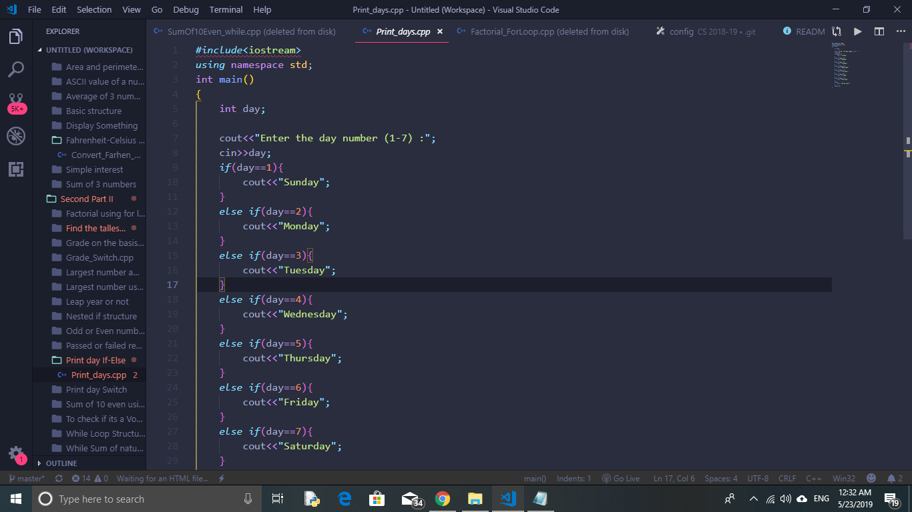
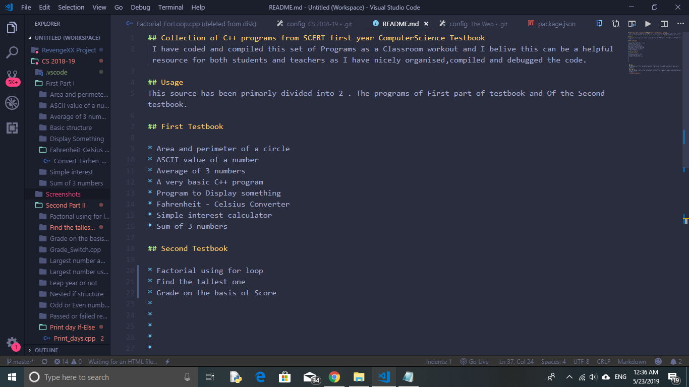
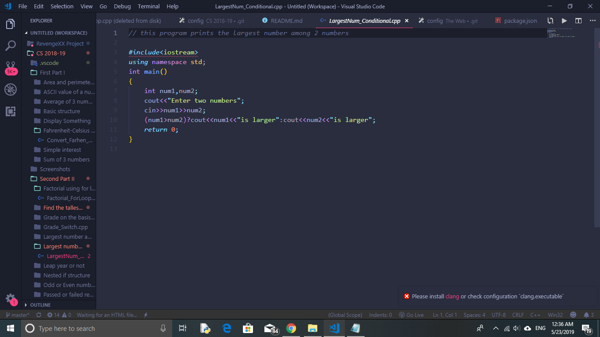

## Collection of C++ programs from SCERT Kerala First year Computer Science Testbook

##### This repository contains the supporting program files needed for teaching computer science First year C++ Programming. It's not the complete and perfect resource but I have tried my best to bring most of the stuff within the reach of you guys

##### I have coded and compiled this set of Programs as a Classroom workout and I belive this can be a helpful resource for both students and teachers as I have nicely organised,compiled and debugged the code. 

### Downloading the code

#### Easy Method

    Just click on the the Clone or download section on the right side and choose Download Zip 

    Extract the files by right by using approprate software

#### Advanced method ( Using git )

    Open terminal

    Type 
    
     sudo apt-get install git-core
    
    
    Grab the link from github

    Type
    
      git clone https://github.com/AmarjithTK/CPP_CS-2018-19.git
    

    Done. It's now downloaded to your PC

### Usage

    Note that ur pc should be installed with GCC compiler
    if you dont have it then you can get it by typing 
        
    $ sudo apt install gcc
    $ sudo apt install build-essential

Navigate to the folder of the file that you want to execute

Type

    $ gcc File_name.cpp -o Output_name
    
Now your Program must be compiled

It's time to execute and run the code

    
    $ ./file_name
    

## Special Notes
This source has been primarly divided into two parts. The C++ programs of First testbook and the Second testbook. The first testbook have no subdivisions and Second tesbook has been divided into different catagories based on chapter and important concepts

## First Testbook

    * Area and perimeter of a circle 
    * ASCII value of a number
    * Average of 3 numbers 
    * A very basic C++ program
    * Program to Display something
    * Fahrenheit - Celsius Converter
    * Simple interest calculator
    * Sum of 3 numbers

## Second Testbook

### For loop
    * Average score of students using for loop
    * Factorial using for loop
    * Fibnocci sequence
    * To check whether a number is prime 
    * To display star pattern

### IF-Else ladder
    * Find the tallest person
    * Grade on the basis of marks
    * Largest number among three 
    * To check whether a leap year or not
    * Nested loop structure
    * Odd or Even number
    * Passed or failed shower
    * Print day if else
    * Square root using if else

### Switch Case
    * Arithmetic operation using switch
    * Grade using switch
    * Print day using switch
    * To check if its a vowel

### While loop
    * To check if its a palindrome using while loop
    * Sum of 10 even numbers using while loop
    * While loop structure
    * Sum of natural numbers

### Miscellaneous ones
    * Find Area using the do while loop 
    * finding the largest number using conditional operators

 ### Note 
 You can make use of this repo without any kind of permission as its made to accomplish open source standards. It's licensed using GNU General public License 3.0 and I'll be very happy to help you if are facing any issues and don't forget to make a comment if I did any mistakes. I'm happy to hear to your suggestions

 ## Credits 
 SCERT for giving us with a great testbook with these handful of programs to help us understand the basic concepts of C++ and go beyond the limits to become the masters of computer science. I hope you guys will update the Testbook with latest developments in computer science

